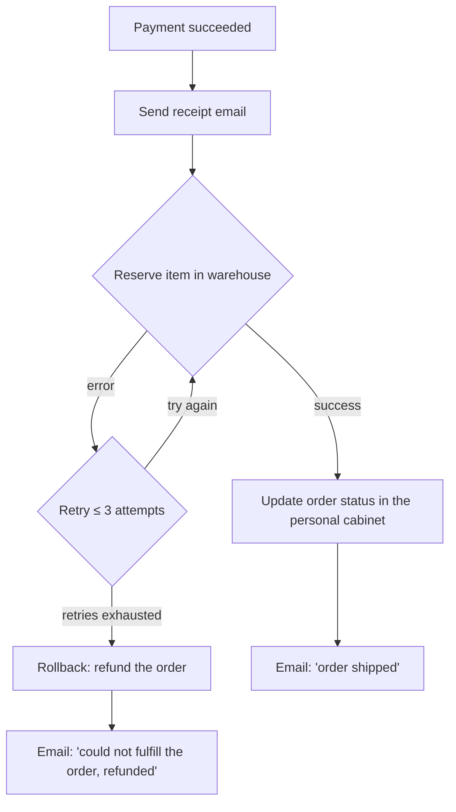

# Background tasks

## What are background tasks?

An HTTP handler needs to respond fast, while part of the work either doesn't have to
block the response (sending an email, calling an external service) or isn't tied to a
request at all (a nightly reconciliation pass, a scheduled digest). That kind of work
gets moved out of the handler into a background task.

Just firing it off with `asyncio.create_task` inside the handler doesn't cut it: the
task lives only in the process's memory and disappears without a trace on a restart, a
deploy, or a crash — along with the very fact that it was ever supposed to run. That's
fine for a log line, but not for a payment, a refund, or a notification the user is
waiting on. The task's state and progress need to live somewhere outside a single
process's memory — somewhere that survives either the app or the worker going down.

Below we'll cover two related but distinct cases:

- [tasks triggered by a request](#async-tasks) — the user did something, and it needs
  to be handled asynchronously
- [tasks triggered by a schedule](#cron) — nothing calls them, they start on their own
  on a cron

In a production-ready setup, dedicated tools handle this by running background tasks in
workers (separate processes) — for example celery, taskiq, temporal, jobify. That buys
you two things:

1. A task isn't lost even if the app or the worker crashes
2. The number of workers can be scaled independently of the HTTP app

We won't cover every option — just the ones the community recommends.

## What the community uses

HeavySwag has no in-memory `BackgroundTasks`-style primitive. The community prefers
[temporal](https://temporal.io) and [jobify](https://theseriff.github.io/jobify/).

=== "Temporal"

    A platform for running asynchronous operations, with SDKs for many languages,
    including Python.

    <video src="https://videos.ctfassets.net/0uuz8ydxyd9p/1VMi8Xh2bEWjaln45C01Bj/1035ec4209abe85ecb74ec90542791d2/SelfHealingWorkflow.mp4" autoplay loop muted playsinline></video>
    <sub>Video taken from the official [temporal.io](https://temporal.io/) website</sub>

    A production-ready solution for running tasks. Temporal implements the saga pattern.

    !!! INFO
        Great for large-scale operations where full observability matters

=== "Jobify"

    A lightweight async job scheduler for Python. Tasks are plain functions decorated
    with `@jobs.task`; retry, timeout, and durability are configured per task, no
    separate server or worker process required — jobs persist via SQLite by default.

    !!! INFO
        Great if you want to keep the infrastructure minimal


## Async tasks {: #async-tasks }

Let's take a real scenario: a user paid for an order in an online store. After the
payment, we need to:

1. Send the user a receipt and payment confirmation by email
2. Reserve the item in the warehouse through an external service
3. Show the order status in the personal cabinet
4. Send an "Order shipped" email

Let's represent the tasks as python functions:

```python
async def send_email_by_user_id(user_id: UUID, message) -> None:
    """Looks up the user's email by user_id and sends the given text"""
    ...

async def reserve_order_on_warehouse(user_id: UUID) -> None:
    """Reserves the item in the warehouse by calling an external service"""
    ...

async def push_purchase_notification(user_id: UUID) -> None:
    """Sends a notification that the order has shipped"""
    ...
```

In an ideal world, this could just run inline in the endpoint:

```python
class CreateOrder(NamedTuple):
    user_id: Body[UUID]


@router.post("/create-order")
async def create_order(_: Request, dto: CreateOrder) -> None:
    user_id = dto.user_id
    
    await send_email_by_user_id(user_id, f"payment received, here's your receipt: {generate_check()}")
    await reserve_order_on_warehouse(user_id)
    await push_purchase_notification(user_id)
    await send_email_by_user_id(user_id, "order shipped")
    
    return Response(status_code=201, body=None)
```

But what happens if the user paid and we couldn't reserve the item in the warehouse?
We need a mechanism for retry (try again) and rollback (undo whatever already ran):

<div style="width: 50%; margin: 0 auto;" markdown="1">


</div>

On the API side, this ends up looking about the same:

```python
@router.post("/create-order")
async def create_order(_: Request, dto: CreateOrder) -> UUID:
    user_id = dto.user_id
    
    order_id = await OrderService().create(user_id=user_id) # (1)!

    return Response(status_code=202, body=order_id)
```

1. We'll define `OrderService` below

=== "Temporal"

    Installation

    ```shell
    uv add temporalio
    ```

    In Temporal, a step with a side effect (a DB write, a call to an external API) is
    called an **activity** — Temporal knows how to retry that specific step if it
    fails. A sequence of activities that owns their execution order and
    retry/rollback policy is called a **workflow**.

    In our case, there's one activity per step, plus a compensating `refund_order` for
    the rollback path, and the workflow wraps the reservation step in `try/except`:
    while the `RetryPolicy` hasn't been exhausted, Temporal keeps retrying on its own;
    if it still fails, the rollback runs and the order fails with an error:

    ```python title="app/tasks.py"
    from datetime import timedelta
    from uuid import UUID

    from temporalio import activity, workflow
    from temporalio.common import RetryPolicy

    TASK_QUEUE = "orders-task-queue"
    RETRY_POLICY = RetryPolicy(maximum_attempts=3, backoff_coefficient=2.0)


    @activity.defn
    async def send_email_by_user_id(user_id: UUID, message: str) -> None: ...


    @activity.defn
    async def reserve_order_on_warehouse(user_id: UUID) -> None: ...


    @activity.defn
    async def refund_order(user_id: UUID) -> None:
        """Compensation: refunds the order if the warehouse never responded"""


    @activity.defn
    async def push_purchase_notification(user_id: UUID) -> None: ...


    @workflow.defn
    class CreateOrderWorkflow:
        @workflow.run
        async def run(self, user_id: UUID) -> None:
            await workflow.execute_activity(
                send_email_by_user_id,
                args=[user_id, "payment received, here's your receipt: ..."],
                start_to_close_timeout=timedelta(seconds=10),
                retry_policy=RETRY_POLICY,
            )

            try:
                await workflow.execute_activity(
                    reserve_order_on_warehouse,
                    args=[user_id],
                    start_to_close_timeout=timedelta(seconds=10),
                    retry_policy=RETRY_POLICY,
                )
            except Exception:  # retries exhausted -> rollback
                await workflow.execute_activity(
                    refund_order,
                    args=[user_id],
                    start_to_close_timeout=timedelta(seconds=10),
                )
                await workflow.execute_activity(
                    send_email_by_user_id,
                    args=[user_id, "couldn't fulfill the order, refunded"],
                    start_to_close_timeout=timedelta(seconds=10),
                )
                raise

            await workflow.execute_activity(
                push_purchase_notification,
                args=[user_id],
                start_to_close_timeout=timedelta(seconds=10),
                retry_policy=RETRY_POLICY,
            )
            await workflow.execute_activity(
                send_email_by_user_id,
                args=[user_id, "order shipped"],
                start_to_close_timeout=timedelta(seconds=10),
                retry_policy=RETRY_POLICY,
            )
    ```

    Starting a workflow needs a `Client`, and opening a new one on every request would
    be wasteful — connect once and reuse it:

    ```python title="app/starter.py"
    from temporalio.client import Client as TemporalClient


    class _ClientHolder:
        client: TemporalClient | None = None


    _holder = _ClientHolder()


    async def get_temporal_client() -> TemporalClient:
        if _holder.client is None:
            _holder.client = await TemporalClient.connect("localhost:7233")

        return _holder.client
    ```

    !!! tip "In a real app, close the client and inject it properly"
        This lazy holder is fine for a quick example, but it never closes its
        connection and it's a module-level singleton. In a more serious setup, close
        the client on shutdown and wire it in through dependency injection instead.

    `OrderService.create` is the entire job of the handler: grab the shared client,
    compute the order id, and start the workflow, without waiting for it to finish.
    That id is generated here, in the service, before the workflow starts — not inside
    `CreateOrderWorkflow.run` itself, where re-running the same code on a retry would
    produce a different value every time:

    ```python title="app/service.py"
    from uuid import UUID, uuid4

    from app.starter import get_temporal_client
    from app.tasks import TASK_QUEUE, CreateOrderWorkflow


    class OrderService:
        async def create(self, user_id: UUID) -> UUID:
            client = await get_temporal_client()
            order_id = uuid4()  # (1)!

            await client.start_workflow(   # (2)!
                CreateOrderWorkflow.run,
                args=[user_id],
                id=f"create-order-{order_id}",
                task_queue=TASK_QUEUE,
            )
            return order_id
    ```

    1. Computed once, here, before the workflow is even started. Workflow code has to
       be deterministic, so anything non-repeatable — a random id, the current time —
       is computed in the service and passed in, never generated inside `workflow.run`.
    2. Starts the task running in a separate process

        Doesn't block the current execution

    The workflow itself doesn't run inside the app — it runs in a separate worker:

    ```python title="app/worker.py"
    import asyncio

    from temporalio.client import Client
    from temporalio.worker import Worker

    from app.tasks import (
        TASK_QUEUE,
        CreateOrderWorkflow,
        push_purchase_notification,
        refund_order,
        reserve_order_on_warehouse,
        send_email_by_user_id,
    )


    async def main() -> None:
        client = await Client.connect("localhost:7233")
        worker = Worker(
            client,
            task_queue=TASK_QUEUE,
            workflows=[CreateOrderWorkflow],
            activities=[
                send_email_by_user_id,
                reserve_order_on_warehouse,
                refund_order,
                push_purchase_notification,
            ],
        )
        await worker.run()


    if __name__ == "__main__":
        asyncio.run(main())
    ```

    Infrastructure — the Temporal server itself (plus its storage and web UI):

    ```yaml title="docker-compose.yaml"
    services:
      postgresql:
        image: postgres:14
        environment:
          POSTGRES_USER: temporal
          POSTGRES_PASSWORD: temporal

      temporal:
        image: temporalio/auto-setup:1.29.4
        depends_on: [postgresql]
        environment:
          - DB=postgres12
          - DB_PORT=5432
          - POSTGRES_USER=temporal
          - POSTGRES_PWD=temporal
          - POSTGRES_SEEDS=postgresql
        ports:
          - "7233:7233"

      temporal-ui:
        image: temporalio/ui:2.51.0
        environment:
          - TEMPORAL_ADDRESS=temporal:7233
        ports:
          - "8233:8080"
    ```

    ```shell
    docker compose up -d           # Temporal server + UI on :8233
    uv run python -m app.worker &  # worker, in the background
    ```

    Every retry and rollback from the diagram above is visible live at
    `http://localhost:8233`.


=== "Jobify"

    Installation

    ```shell
    uv add jobify
    ```

    A step with a side effect is just a plain function decorated with `@jobs.task` —
    retry policy and timeout live on the decorator itself, there's no separate
    "activity" concept. Orchestration (the retry/rollback sequence from the diagram
    above) is just another task that pushes the steps and waits for them:

    ```python title="app/tasks.py"
    import asyncio
    from uuid import UUID

    from jobify import Jobify, JobFailedError, SmartRetry

    jobs = Jobify()

    STEP_RETRY = SmartRetry(retries=3, initial_delay=1.0, backoff_factor=2.0)


    @jobs.task(retry=STEP_RETRY, timeout=10)
    async def send_email_by_user_id(user_id: UUID, message: str) -> None: ...


    @jobs.task(retry=STEP_RETRY, timeout=10)
    async def reserve_order_on_warehouse(user_id: UUID) -> None: ...


    @jobs.task(timeout=10)
    async def refund_order(user_id: UUID) -> None:
        """Compensation: refunds the order if the warehouse never responded"""


    @jobs.task(retry=STEP_RETRY, timeout=10)
    async def push_purchase_notification(user_id: UUID) -> None: ...


    @jobs.task(durable=True)  # (1)!
    async def create_order_workflow(user_id: UUID) -> None:
        receipt = await send_email_by_user_id.push(
            user_id, "payment received, here's your receipt: ..."
        )
        await receipt.wait()

        reservation = await reserve_order_on_warehouse.push(user_id)

        try:
            await reservation  # (2)!
        except JobFailedError:
            refund = await refund_order.push(user_id)
            notice = await send_email_by_user_id.push(
                user_id, "couldn't fulfill the order, refunded"
            )
            await asyncio.gather(refund, notice)  # (3)!
        else:
            notify = await push_purchase_notification.push(user_id)
            shipped = await send_email_by_user_id.push(user_id, "order shipped")
            await asyncio.gather(notify, shipped)
    ```

    1. `durable=True` is actually the default — spelled out here just to make the
       guarantee visible: this job survives a crash or restart.
    2. `await job` is shorthand for `await job.wait()` + `job.result()`.
    3. Each `Job` returned by `push()` is itself awaitable — awaiting it waits for the
       task's result and returns it, or raises the error if the task failed. `gather`
       just does that for both jobs at once, concurrently.

    Wire the `Jobify` instance into the app's lifespan

    ```python
    async def lifespan(app: HeavySwag) -> AsyncIterator[None]:
        async with jobs:
            yield None
    ```

    `OrderService.create` fires the workflow and returns immediately:

    ```python title="app/service.py"
    from uuid import UUID, uuid4

    from app.tasks import create_order_workflow


    class OrderService:
        async def create(self, user_id: UUID) -> UUID:
            order_id = uuid4()  # (1)!
            await create_order_workflow.push(user_id)  # (2)!
            return order_id
    ```

    1. Computed here, not inside `create_order_workflow` — same reason as in the
       Temporal example: a task can be retried, so anything non-repeatable has to be
       computed once, outside the retryable code.
    2. `push()` enqueues and returns immediately — it doesn't wait for the task to run

    !!! tip "No separate worker process needed"
        Unlike Temporal, there's no server or `worker.py` to run — jobs execute inside
        the same app process, and the default `SQLiteStorage` persists them so a crash
        or redeploy doesn't lose an in-flight order.

!!! warning
    Keep in mind that these libraries are built for io-bound work — if you try to run
    blocking operations on them, timeouts and stuck workers are a common outcome under
    load.
    

## Cron {: #cron }

We won't cover every scheduling option, e.g. every 15 minutes — just the general idea.

=== "Temporal"

    A cron workflow is no different from a regular one — the same activity execution,
    just triggered by a schedule instead of a request:

    ```python title="app/tasks.py"
    from datetime import timedelta

    from temporalio import activity, workflow

    TASK_QUEUE = "orders-task-queue"


    @activity.defn
    async def cleanup_expired_orders() -> None:
        """Cancels orders that were never paid"""


    @workflow.defn
    class CleanupExpiredOrdersWorkflow:
        @workflow.run
        async def run(self) -> None:
            await workflow.execute_activity(
                cleanup_expired_orders,
                start_to_close_timeout=timedelta(minutes=5),
            )
    ```

    ```python title="app/schedule.py"
    from temporalio.client import Client, Schedule, ScheduleActionStartWorkflow, ScheduleSpec

    from app.tasks import TASK_QUEUE, CleanupExpiredOrdersWorkflow


    async def main() -> None:
        client = await Client.connect("localhost:7233")

        await client.create_schedule(
            "cleanup-expired-orders",
            Schedule(
                action=ScheduleActionStartWorkflow(
                    CleanupExpiredOrdersWorkflow.run,
                    id="cleanup-expired-orders-run",
                    task_queue=TASK_QUEUE,
                ),
                spec=ScheduleSpec(cron_expressions=["0 3 * * *"]),  # every day at 03:00
            ),
        )
    ```

    `CleanupExpiredOrdersWorkflow` gets registered on the worker exactly like
    `CreateOrderWorkflow` above — the schedule just triggers it on a cron.

=== "Jobify"

    The simplest way is a `cron=` parameter right on the task itself — no separate
    schedule object to register at startup:

    ```python title="app/tasks.py"
    from jobify import Cron, Jobify, MisfirePolicy

    jobs = Jobify()


    @jobs.task(
        name="orders:cleanup-expired",
        cron=Cron("0 3 * * *", misfire_policy=MisfirePolicy.SKIP),  # every day at 03:00
        timeout=300,
    )
    async def cleanup_expired_orders() -> None:
        """Cancels orders that were never paid"""
    ```

    Jobify also supports setting the schedule imperatively at runtime, closer to how
    Temporal's `create_schedule` works, via `task.schedule().cron(...)`:

    ```python
    await cleanup_expired_orders.schedule().cron(
        cron="0 3 * * *",
        job_id="cleanup-expired-orders",  # required, used to update/replace later or deduplication
    )
    ```

    The decorator form is the source of truth for code and is restored as-is every time the application
    restarts, which is good for fixed schedules. The imperative form, on the other hand, is the source
    of truth for storage, keyed by job_id, and is intended for schedules that you create, update,
    or remove while the application is running.


## Patterns for background tasks

- Move every blocking operation — synchronous calls, cpu-bound work — out of the
  worker into a separate process, and use the worker itself only to wait for the
  result.
- Plan for a step to fail: you need retry (how many times, how long to wait between
  attempts) and rollback (a compensating action that undoes whatever already ran) —
  exactly what the order example above does.
- **Idempotency** — since a step can be re-run on retry, any non-repeatable
  computation (random values, the current time, reading state that may have changed
  since) must be computed once, before the task starts, and passed into it as a ready
  value instead of being recomputed on every attempt — otherwise a retry-driven
  re-run produces a different result and breaks the expected behavior.
- **Outbox** — write the operation to the database first, in the same transaction as
  the business logic, and only then trigger its execution from a separate process, so
  the task isn't lost even if the app crashes before the worker is called.
- **Saga** — give the operation an entity with its own set of statuses and track the
  progress of a multi-step operation in real time.
- Publish events to interact with other domains and services asynchronously — useful
  when a task needs to be split into independent parts that run in parallel.


## Closing thoughts

Pick a library based on your actual needs, and use the design patterns described in
"Patterns for background tasks". Explore what each library offers — for example,
Temporal has [task queue priority out of the box](https://docs.temporal.io/develop/task-queue-priority-fairness).
